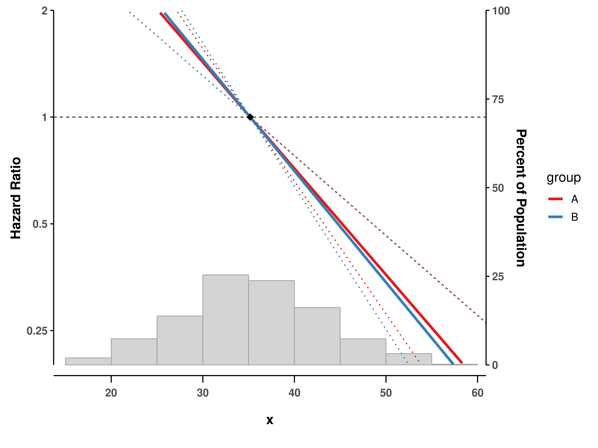

<!-- README.md is generated from README.Rmd. Please edit that file -->

# splineplot

<!-- badges: start -->

[](https://github.com/jinseob2kim/splineplot/actions)
[](https://cran.r-project.org/package=splineplot)
[](https://CRAN.R-project.org/package=splineplot)
[](https://app.codecov.io/gh/jinseob2kim/splineplot?branch=main)
[](https://github.com/jinseob2kim/splineplot/issues)
[](https://github.com/jinseob2kim/splineplot/stargazers)
[](https://lifecycle.r-lib.org/articles/stages.html#experimental)
<!-- badges: end -->

The **splineplot** package provides a unified interface for visualizing
spline effects from GAM (Generalized Additive Models) and GLM
(Generalized Linear Models) in R. It creates publication-ready plots
with confidence intervals, supporting various model types including
Linear, Logistic, Poisson, and Cox proportional hazards models.

## Key Features

- 📊 **Unified visualization** for spline effects across different model
  types
- 🎨 **Publication-ready plots** with customizable aesthetics
- 📈 **Automatic detection** of spline terms and interaction variables
- 🔄 **Support for multiple spline types**: GAM smooths (`s()`, `te()`,
  `ti()`), GLM splines (`ns()`, `bs()`), and Cox `pspline()`
- 📉 **Flexible confidence intervals**: dotted lines or ribbon style
- 📊 **Built-in histograms** showing data distribution
- 🎯 **Reference point marking** with automatic SE = 0 at reference
  value
- 🔀 **Interaction term support** with by-variable visualization

## Installation

You can install the released version of splineplot from CRAN:

``` r
install.packages("splineplot")
```

Or install the development version from GitHub:

``` r
# install.packages("devtools")
devtools::install_github("jinseob2kim/splineplot")
```

## Basic Usage

``` r
library(splineplot)
library(mgcv)
library(survival)
library(splines)
library(ggplot2)

# Generate sample data
set.seed(123)
n <- 500
x <- rnorm(n, mean = 35, sd = 8)
lp <- -0.06*(x - 35) + 0.0009*(x - 35)^3/(8^2)
time <- rexp(n, rate = exp(lp))
status <- rbinom(n, 1, 0.8)
binary_y <- rbinom(n, 1, plogis(lp))

dat <- data.frame(x, time, status, binary_y)
```

### GAM with Cox family

``` r
# Fit GAM Cox model
fit_gam_cox <- gam(time ~ s(x),
                   family = cox.ph(), weights = status, data = dat)

# Create spline plot
splineplot(fit_gam_cox, dat,
          ylim = c(0.2, 2.0),
          xlab = "Age (years)",
          ylab = "Hazard Ratio")
#> Using 'x' as x variable
#> Using refx = 35.17 (median of x)
#> Warning: Removed 61 rows containing missing values or values outside the scale range
#> (`geom_line()`).
#> Warning: Removed 56 rows containing missing values or values outside the scale range
#> (`geom_line()`).
#> Warning: Removed 54 rows containing missing values or values outside the scale range
#> (`geom_line()`).
```


### Logistic regression with natural splines

``` r
# Fit logistic model with natural splines
fit_glm <- glm(binary_y ~ ns(x, df = 4),
               family = binomial(), data = dat)

# Create spline plot
splineplot(fit_glm, dat,
          ylim = c(0.2, 2.0),
          ylab = "Odds Ratio")
#> Using 'x' as x variable
#> Using refx = 35.17 (median of x)
#> Warning: Removed 34 rows containing missing values or values outside the scale range
#> (`geom_line()`).
#> Warning: Removed 85 rows containing missing values or values outside the scale range
#> (`geom_line()`).
#> Warning: Removed 59 rows containing missing values or values outside the scale range
#> (`geom_line()`).
```


### GAM with interaction terms

``` r
# Add a grouping variable
dat$group <- factor(sample(c("A", "B"), n, replace = TRUE))

# Fit model with interaction
fit_interaction <- gam(time ~ s(x, by = group),
                      family = cox.ph(),
                      weights = status,
                      data = dat)

# Plot with interaction
splineplot(fit_interaction, dat,
          ylim = c(0.2, 2.0))
#> Using 'x' as x variable
#> Detected interaction with 'group'
#> Using refx = 35.17 (median of x)
#> Warning: No shared levels found between `names(values)` of the manual scale and the
#> data's fill values.
#> Warning: Removed 124 rows containing missing values or values outside the scale range
#> (`geom_line()`).
#> Warning: Removed 116 rows containing missing values or values outside the scale range
#> (`geom_line()`).
#> Warning: Removed 110 rows containing missing values or values outside the scale range
#> (`geom_line()`).
```



## Advanced Features

### Customizing confidence intervals

``` r
# Default: dotted lines
splineplot(fit_gam_cox, dat, ribbon_ci = FALSE)

# Alternative: ribbon/shaded area
splineplot(fit_gam_cox, dat, ribbon_ci = TRUE)
```

### Log scale for odds/rate/hazard ratios

``` r
# Use log scale for y-axis
splineplot(fit_glm, dat, log_scale = TRUE)
#> Using 'x' as x variable
#> Using refx = 35.17 (median of x)
```


### Custom reference values

``` r
# Set custom reference point (default is median)
splineplot(fit_gam_cox, dat,
          refx = 40,  # Reference at x = 40
          show_ref_point = TRUE)  # Show diamond marker
#> Using 'x' as x variable
```


## Supported Model Types

| Model Type | Model Function | Spline Types | Outcome |
|:---|:---|:---|:---|
| GAM | `mgcv::gam()` | `s()`, `te()`, `ti()` | HR, OR, RR, Effect |
| GLM | `stats::glm()` | `ns()`, `bs()` | OR, RR, Effect |
| Linear | `stats::lm()` | `ns()`, `bs()` | Effect |
| Cox | `survival::coxph()` | `ns()`, `bs()`, `pspline()`\* | HR |

\*Note: `pspline()` has limited support due to its internal structure.
We recommend using `ns()` or `bs()` with Cox models for optimal results.

## Function Parameters

| Parameter        | Description                 | Default                 |
|:-----------------|:----------------------------|:------------------------|
| `fit`            | Fitted model object         | Required                |
| `data`           | Data frame used for fitting | Required                |
| `xvar`           | Variable name for x-axis    | Auto-detected           |
| `by_var`         | Interaction variable        | Auto-detected           |
| `refx`           | Reference x value           | Median of x             |
| `xlim`           | X-axis limits               | Data range              |
| `ylim`           | Y-axis limits               | Auto                    |
| `show_hist`      | Show histogram              | TRUE                    |
| `ribbon_ci`      | Use ribbon CI style         | FALSE                   |
| `log_scale`      | Use log scale for y-axis    | FALSE                   |
| `show_ref_point` | Show reference point marker | TRUE                    |
| `xlab`           | X-axis label                | Variable name           |
| `ylab`           | Y-axis label                | Auto by model           |
| `ylab_right`     | Right y-axis label          | “Percent of Population” |

## Citation

If you use splineplot in your research, please cite:

``` r
citation("splineplot")
```

## Getting Help

- **Documentation**: Visit our [pkgdown
  site](https://jinseob2kim.github.io/splineplot/)
- **Bug reports**: [GitHub
  Issues](https://github.com/jinseob2kim/splineplot/issues)

## Contributing

Contributions are welcome! Please feel free to submit a Pull Request.
For major changes, please open an issue first to discuss what you would
like to change.

## License

Apache License 2.0 © Jinseob Kim / Zarathu

## Acknowledgments

Special thanks to the developers of
[mgcv](https://cran.r-project.org/package=mgcv),
[survival](https://cran.r-project.org/package=survival), and
[ggplot2](https://cran.r-project.org/package=ggplot2) packages.
